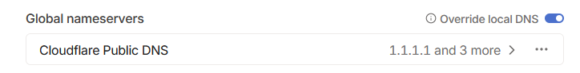

## Concepts & Definitions

**_LLM (Large Language Model)_** - Refers to the neural network (a type of model inspired on the human brain) used for natural language, such as text2text generation(gpt-4), text classification or sentiment analysis(BERT). The main idea behind it is a text completion mechanism with high accuracy (ideally) for predicting the next word or set of words in a given context.

[https://en.wikipedia.org/wiki/Large_language_model](https://en.wikipedia.org/wiki/Large_language_model)

**_Diffusion Model_** - Image generation models that apply noise to an image and use a neural network to denoise it (Stable diffusion, Dall-e), it’s a complex topic but, TLDR: depending on the sampler and parameters used the image won't necessarily converge in a singular image. Note that those models can (and should) also receive a text input to guide the denoising.

[https://arxiv.org/html/2312.14977v1](https://arxiv.org/html/2312.14977v1)

**_Inference_** - The process of running data into a model to get an output, depending on the type and architecture of said model the output is translated into text(gpt-4,Claude,mistral), images(stable diffusion,Midjourney,gpt-4-vision), sound(XTTS), etc. 

**_Instruct model_** - Refers to a base LLM trained or fine-tuned with pairs of questions/instructions - answers to enhance the model’s capability of providing a valid or coherent response to a given question or instruction (mixtral-instruct,gpt-3.5-turbo-instruct,gpt-4). Note that this is just nomenclature for the training data used, there’s also chat models and others but most don’t really specify it.

**_Transformers_** - Base architecture of the contemporary neural networks. Based on Google's research paper from 2017: 

[https://blog.research.google/2017/08/transformer-novel-neural-network.html](https://blog.research.google/2017/08/transformer-novel-neural-network.html)

[https://arxiv.org/abs/1706.03762](https://arxiv.org/abs/1706.03762)

**_MoE (Mixture of Experts)_** - The latest architecture of transformer-based LLMs, consists of a mix of several smaller models (experts) where the input data gets routed through the most capable of the experts for a given task. Mixtral and GPT-4(allegedly) use this architecture.

**_LoRA (Low-Rank Adaptation)_** - Refers to the technique, or the actual trained weights, that can be applied to a larger model in a much more cost efficient way, usually for fine tuning or applying styles.

[https://huggingface.co/docs/diffusers/main/en/training/lora](https://huggingface.co/docs/diffusers/main/en/training/lora)

[https://arxiv.org/abs/2106.09685](https://arxiv.org/abs/2106.09685)

**_Parameters_** - Basically the model size. It can mean different stuff but mostly the weights of the model, which are the connections between the data in the dataset the model was trained on. The more it has the more complex the model is, which usually means (not necessarily tho) better reasoning and understanding of the input. Usual open source model sizes are 7, 11, 13, 30 or 70 billion parameters. For reference LLama2 has 70b and gpt-3.5 180b. Note that while size matters, the quality of the training data and method used for it matter significantly more, which can make bigger models obsolete due to the speed at which the technology is advancing.

**_Token_** - The most basic form of a word that the model can understand and translate into its code, usually (but not really) just the lexical root of a word without its differentiable morphemes. Depends entirely on the model used and its tokenizer.

**_Context_** - The amount of data(in tokens) provided to the model to get a response from. The more context the more VRAM the model needs to run. For reference LLama2 has native 4k (4096) context. There are ways to artificially increase context size but, as it’s the case for image models, using higher context/resolutions that what the model was trained for may cause undesirable results.

**_Prompt_** - A text that directs the LLM to generate a specific response, often an instruction or a question provided in the context. 

Prompts can become complex and some can try to force the LLM to behave in certain ways that might enhance the responses, make them significantly more accurate or simply roleplay in a specific scenario for example. There are a lot of resources about prompt engineering around the community for any kind of use case.

**_Embeddings_** - A way to store data that the model can understand, usually used by the model or as part of the workflow, for example to replace larger prompts or parts of a prompt.

[https://pub.aimind.so/llm-embeddings-explained-simply-f7536d3d0e4b](https://pub.aimind.so/llm-embeddings-explained-simply-f7536d3d0e4b)

**_Quantization_** - Refers to the technique used to reduce a model’s size by reducing each of its weight’s size, also increasing its performance. Like truncating or rounding them but more complex. There’s usually a sweet spot between performance and quality loss but it depends on many things like the actual model or the way it's quantized.

[https://huggingface.co/docs/optimum/concept_guides/quantization](https://huggingface.co/docs/optimum/concept_guides/quantization)

**_VRAM (Video Random-Access Memory)_** - It's the memory used for graphic computing that your GPU (video card) uses, it’s faster than RAM and it's the key to run the kind of computations that these models require. 

**_API (Application programming interface)_** - A way to communicate with a piece of software, in our case to the inference server that loads the model (some have integrated UI’s but most offer an API endpoint). 

*Huggingface has a lot of guides with videos on Youtube about some of these concepts and how to use their libraries:

[https://huggingface.co/docs](https://huggingface.co/docs)

[https://huggingface.co/docs/transformers/index](https://huggingface.co/docs/transformers/index)

## Popular Models & Services

### Text Generation

* [GPT-4](https://chat.openai.com/chat): 
    * [OpenAI](https://openai.com/)’s Leading LLM, sadly quite censored lately, with guardrails for controversial topics.
* [Claude3](https://claude.ai/chats): 
    * [Anthropic](https://www.anthropic.com/)’s new LLM, apparently the only real competition GPT-4 has besides mistral-large. Couple variants, and the smaller models are decently smart and affordable through API.
* [LLama2](https://huggingface.co/chat/): 
    * [Meta](https://llama.meta.com/)’s open sourced model, it’s starting to show its age with the release of mistral/mixtral based models.
* [Llama3](https://huggingface.co/meta-llama/Meta-Llama-3-8B):
    * New models(8B/70B) from Meta, pretty good.
* [Mistral-7b](https://huggingface.co/chat/): 
    * Small and decently smart open source model developed by [mistral.ai](https://mistral.ai), fits on consumer hardware, it’s actually very smart for its size and has a ton of community variants and flavors for many use cases.
* [Mixtral-8x7b](https://huggingface.co/chat/): 
    * Same as mistral-7b but MoE architecture with 8 experts, around 13b parameters are active on inference and people claim it’s smarter than gpt-3.5. Needs 20GB+ to run.
    * [https://arxiv.org/abs/2401.04088](https://arxiv.org/abs/2401.04088)
* [Mistral Large](https://chat.mistral.ai/chat) and other [mistral.ai](https://mistral.ai) models: 
    * Smart but they are paid only through API unlike mistral/mixtral.
* [Gemini](https://gemini.google.com/?hl=es) and [Gemma](https://blog.google/technology/developers/gemma-open-models/) google models: 
    * Apparently worse than gpt-4 but the API has a free tier, and has integration with google services. Gemma is open source, but just 7b parameters.

*There’s a massive community in [Huggingface.co](https://Huggingface.co) where people make constant mixes of several popular models with different datasets, mostly focused on assistant, chat, [RAG](https://research.ibm.com/blog/retrieval-augmented-generation-RAG) or roleplay use cases.

Some models are significantly better than the base model, but also some of the models suffer from contamination where the shortcomings of the dataset(writing style, summarization issues…) of a model get worse or more obvious because of the mixing of models with the same base model.

For reference on the best models for a given task there are several leaderboards around, some of them on the site itself, that said the leaderboards should be seen strictly as a reference due to the complexity of the models and the technology itself.

#### Some personal favorites:

Some mixes and pre-trained models that I used(in exllama/kobold.cpp) and performed well, and some others that I want to try, I’ll try to keep it updated.

* [mistralai/Mistral-7B-Instruct-v0.2](https://huggingface.co/mistralai/Mistral-7B-Instruct-v0.2) - Smart and 32k context. The base for most finetunes/mixes right now.
* [upstage/SOLAR-10.7B-Instruct-v1.0](https://huggingface.co/upstage/SOLAR-10.7B-Instruct-v1.0) - Pretty smart for its size.
* [01-ai/Yi-9B-200K](https://huggingface.co/01-ai/Yi-9B-200K) - 200k context and apparently good at coding(probably not comparable to much bigger models, haven't tried it yet). You’ll need a lot of VRAM for the full context.
* [senseable/WestLake-7B-v2](https://huggingface.co/senseable/WestLake-7B-v2) - Roleplay/Chat. Needs 5bpw quantization to fit on 12GB with full context.
* [froggeric/WestLake-10.7B-v2-GGUF](https://huggingface.co/froggeric/WestLake-10.7B-v2-GGUF) - Pretty new, more creative/less instruction following than WestLake-7B-v2. Needs 4bpw(or less) to fit on 12GB.
* [SanjiWatsuki/Kunoichi-DPO-v2-7B](https://huggingface.co/SanjiWatsuki/Kunoichi-DPO-v2-7B) - One of the best for RP/Chat below 20B(allegedly). Fits at 8bpw quant with the full 8k context.
* [Sao10K/Fimbulvetr-11B-v2-GGUF](https://huggingface.co/Sao10K/Fimbulvetr-11B-v2-GGUF) - The other one of the best for RP/Chat below 20B(allegedly). Only 4k context tho, fits at 6bpw on 12GB.
* [Llama 3](https://huggingface.co/meta-llama/Meta-Llama-3-8B) - Very smart.
* [Sao10K/L3-8B-Stheno-v3.1](https://huggingface.co/Sao10K/L3-8B-Stheno-v3.1) - Good Llama3 finetune for RP.
* [KoboldAI/LLaMA2-13B-Psyfighter2-GGUF](https://huggingface.co/KoboldAI/LLaMA2-13B-Psyfighter2-GGUF) - Pretty good for RP/Chat but comparable to lower sized models available. 13B are harder to fit in 12GB.

Bigger models (+12GB VRAM needed):

* [mistralai/Mixtral-8x7B-Instruct-v0.1](https://huggingface.co/mistralai/Mixtral-8x7B-Instruct-v0.1) - Pretty smart.
* [NeverSleep/Noromaid-v0.1-mixtral-8x7b-Instruct-v3](https://huggingface.co/NeverSleep/Noromaid-v0.1-mixtral-8x7b-Instruct-v3) - [NeverSleep/Noromaid-v0.4-Mixtral-Instruct-8x7b-Zloss](https://huggingface.co/NeverSleep/Noromaid-v0.4-Mixtral-Instruct-8x7b-Zloss) - Mixtral but for RP/Chat, can get repetitive and needs a bit of careful prompting.

More models: [https://huggingface.co/spaces/HuggingFaceH4/open_llm_leaderboard](https://huggingface.co/spaces/HuggingFaceH4/open_llm_leaderboard)

### Image Generation

* [Stability.ai](https://Stability.ai)‘s stable diffusion: 
    * Popular base model for image generation, it’s fast and resource friendly and a lot of models are built from it. Default size is 512x512.
    * Supported resolutions: Anything below 768 pixels.
    * [https://stability.ai/stable-image](https://stability.ai/stable-image)
    * [https://github.com/Stability-AI/StableDiffusion](https://github.com/Stability-AI/StableDiffusion)
* [Runway research](https://research.runwayml.com/)’s Stable-diffusion v1.5: 
    * One of the many iterations of SD and the flagship model for open source image generation, it’s very versatile, fast and resource friendly. It has a massive amount of variants and support from the community.
    * [https://huggingface.co/runwayml/stable-diffusion-v1-5](https://huggingface.co/runwayml/stable-diffusion-v1-5)
* [Stability.ai](https://Stability.ai)‘s SDXLv1.0:
    * The next generation model from Stability.ai, less flexible and more resource costly than SD 1.5 but with higher resolution/detailed outputs and tuned for better quality and less reliance on negative prompts. Default size is 1024x1024.
    * [https://huggingface.co/stabilityai/stable-diffusion-xl-base-1.0](https://huggingface.co/stabilityai/stable-diffusion-xl-base-1.0)
    * _Supported resolutions_:
    * 640 x 1536: 10:24 or 5:12
    * 768 x 1344: 16:28 or 4:7
    * 832 x 1216: 13:19
    * 896 x 1152: 14:18 or 7:9
    * 1024 x 1024: 1:1
    * 1152 x 896: 18:14 or 9:7
    * 1216 x 832: 19:13
    * 1344 x 768: 21:12 or 7:4
    * 1536 x 640: 24:10 or 12:5
* Midjourney:
    * [https://www.midjourney.com/home](https://www.midjourney.com/home)
    * [https://nijijourney.com](https://nijijourney.com)
* GPT-4-Vision: 
    * OpenAI’s image model, integrated in their subscription service, it’s separate in the API.

*Same as for the LLM space, [Civit.ai](https://Civit.ai) has a massive community with models for any use case.

Check the specific model/finetune page for optimal resolutions.

#### Some Personal Favorites:

* [https://civitai.com/models/133005/juggernaut-xl](https://civitai.com/models/133005/juggernaut-xl) - Based on SDXL Lightning. Pretty good & realistic: [Image1](https://civitai.com/images/9852659), [image2](https://civitai.com/images/8924547).
* [https://civitai.com/models/139562/realvisxl-v40](https://civitai.com/models/139562/realvisxl-v40) - Based on SDXL Lightning.

Anime:

* [https://civitai.com/models/260267/animagine-xl-v31](https://civitai.com/models/260267/animagine-xl-v31) - Based on SDXL, great composition.
* [https://civitai.com/models/317902/t-ponynai3](https://civitai.com/models/317902/t-ponynai3) - Based on [Pony](https://civitai.com/models/257749/pony-diffusion-v6-xl) & [NAI3](https://docs.novelai.net/image.html). Good composition, better faces/expressions. Large prompts require lowering CFG to avoid artifacts/saturation. 
* [https://civitai.com/models/4468/counterfeit-v30](https://civitai.com/models/4468/counterfeit-v30) - Based on SD 1.5, great composition.
* [https://civitai.com/models/27259/tmnd-mix](https://civitai.com/models/27259/tmnd-mix) - Based on SD 1.5, cutest waifus & cute style at low sampling steps.

### Text to Speech/Sound Generation

* Silero-tts: 
    * [https://github.com/snakers4/silero-models](https://github.com/snakers4/silero-models)
* [XTTSv2](https://huggingface.co/coqui/XTTS-v2): 
    * One of the best open source tts models, can do voice cloning with 6s audio files. Unfortunately [Coqui.ai](https://Coqui.ai) is shutting down.
* [Suno.ai](https://www.suno.ai/)’s Bark:
    * Not just a tts model but text2sound, which can deviate from the provided prompt. Not the same as their song generation model though.
    * [https://github.com/suno-ai/bark/tree/main](https://github.com/suno-ai/bark/tree/main)
* Suno.ai’s [Chirp v1](https://app.suno.ai/):
    * Their song generation model, based on Bark.

### Speech to Text Generation

* OpenAI’s Whisper models:
    * Decent voice recognition and there are different versions with different model sizes.
    * [https://github.com/openai/whisper](https://github.com/openai/whisper)
    * [https://huggingface.co/openai/whisper-large-v3](https://huggingface.co/openai/whisper-large-v3)
    * [https://huggingface.co/collections/openai/whisper-release-6501bba2cf999715fd953013](https://huggingface.co/collections/openai/whisper-release-6501bba2cf999715fd953013)

## Software

The actual libraries([transformers](https://github.com/huggingface/transformers), [ExLlamaV2](https://github.com/turboderp/exllamav2), [Llama.cpp](https://github.com/ggerganov/llama.cpp), [diffusers](https://github.com/huggingface/diffusers)…) to run the models are integrated in these backend solutions, they also offer a simple UI and an API to connect to from any frontend. There is a lot of documentation on how to run these projects, they are self sufficient for basic tasks and some have modules and extensions for extra functionality or an API server to connect to from any other source. There are also plenty of frontend solutions to connect to those API endpoints.

Note that most of this software can be run on google colab free tier, and there are several already configured colabs around the community.

### Text Generation

* [Llama.cpp](https://github.com/ggerganov/llama.cpp): 
    * Single file solution for text inference with an API server and integrated UI, very easy to run as it’s just a single executable without the need of any install, can run fully on GPU or split between VRAM/RAM for when a model is too large to fit entirely on your GPU.
* [Kobold.cpp](https://github.com/LostRuins/koboldcpp): 
    * It’s an improved fork of llama.cpp, supposedly faster and with some extra functionalities.
* [ExLlamaV2](https://github.com/turboderp/exllamav2):
    * Very fast and multiple GPUs are supported.
* [Oobabooga’s text-generation-ui](https://github.com/oobabooga/text-generation-webui): 
    * The most versatile and definitely the best one to start with, integrates llama.cpp and exllama among others. It has several extensions and an API server.
* [SillyTavern](https://sillytavernai.com/): 
    * An excellent frontend-only solution for anything LLM related. While heavily focused on chat/roleplay, it offers great flexibility and lots of integrations with all kinds of services and backends, be it local or not. Also has modules to integrate web search, speech recognition, text-to-speech and image generation backends.
    * Scripts for easy installation, also for installing required software like node, cuda, buildtools, some ui’s(oobabooga’s, koboldcpp,some sd webuis…), etc: [https://github.com/SillyTavern/SillyTavern-Launcher](https://github.com/SillyTavern/SillyTavern-Launcher)
* [llama.sh](https://github.com/m18coppola/llama.sh):
    * Simple frontend for the command line.
* [mikupad.html](https://github.com/lmg-anon/mikupad):
    * Simple frontend for the browser.
    * [https://lmg-anon.github.io/mikupad/mikupad.html](https://lmg-anon.github.io/mikupad/mikupad.html)

*Note that while back-ends are needed for running local models, there are also a lot of online front-end solutions that can connect to your API if you enable the server on your end. Preferably use a personal VPN instead of opening ports on the router, or a reverse proxy like [NPM](https://nginxproxymanager.com/) or [NginX](https://www.nginx.com/) if you need to use SSL for things like speech recognition over the internet and such.

More UIs: [https://github.com/JShollaj/Awesome-LLM-Web-UI](https://github.com/JShollaj/Awesome-LLM-Web-UI)

**My recommended setup for text generation:**

For an all-in-one solution: Oobabooga’s for compatibility of models(and access to TTS, speech recognition, web search, RAG thru extensions), or kobold.cpp if you’re low on VRAM (to run .gguf models split between RAM/VRAM). Or [exui](https://github.com/turboderp/exui) for running .exl2 (exllama2 model type) if you want something very lightweight.

For a lightweight only-backend solution to just run the API server: [TabbyAPI](https://github.com/theroyallab/tabbyAPI) (for .exl2 specifically) or [Aphrodite](https://github.com/PygmalionAI/Aphrodite-engine).

For a frontend solution: Oobabooga for general tasks, RAG & web search or SillyTavern for chatting & roleplay, altho it also has some RAG and web search functionalities. There are other alternatives for RAG/web search but they’re all still a bit green in my opinion: [chat-ui](https://github.com/huggingface/chat-ui) has the most decent web search but no RAG, [h2oGPT](https://github.com/h2oai/h2ogpt) supports RAG & web search, and [ChainFury](https://github.com/NimbleBoxAI/ChainFury) seems to have both too.

Personally I use either Oobabooga’s both for the API server and the UI, or just TabbyAPI with ST depending on my use case. It’s also the easiest setup since the ST scripts lets you install everything you need and more.

**Some Videos about SillyTavern and it’s capabilities:**

Step by step: 

1.[ https://www.youtube.com/watch?v=M1mOhXwI97s](https://www.youtube.com/watch?v=M1mOhXwI97s) 

2.[ https://youtu.be/xYtXonP8SK0](https://www.youtube.com/watch?v=xYtXonP8SK0) 

3.[ https://youtu.be/WRTWyPXYotE](https://www.youtube.com/watch?v=WRTWyPXYotE) 

4.[ https://youtu.be/d5XFO_l_3wA](https://www.youtube.com/watch?v=d5XFO_l_3wA) 

5.[ https://www.youtube.com/watch?v=0R-SUd_KJ6A](https://www.youtube.com/watch?v=0R-SUd_KJ6A) 

6.[ https://youtu.be/XiDFBNqdoc4](https://www.youtube.com/watch?v=XiDFBNqdoc4)

### Image Generation

* [Automatic1111’s stable-diffusion-webui](https://github.com/AUTOMATIC1111/stable-diffusion-webui): 
    * The most popular solution for running SD and adjacent models, extremely versatile with tons of extensions, even has an extension to use it in Photoshop. Using ‘--xformers’ is not needed.
* [lllyasviel’s stable-diffusion-webui-forge](https://github.com/lllyasviel/stable-diffusion-webui-forge):
    * Built on top of A1111’s for better performance and compatibility with hardware. It’s a 10-20% speed up with recommended settings compared to A1111’s, also better memory management. Using ‘–xformers’ is not recommended.
* [ConfyUI](https://github.com/comfyanonymous/ComfyUI):
    * Better workflow and more lightweight than A1111’s but less popular and versatile, A1111’s also has an extension for it.

**My recommended setup for image generation:**

You can easily try most of the UIs for image generation with the project [StabilityMatrix](https://github.com/LykosAI/StabilityMatrix), it lets you easily install those projects with a shared folder for the models and such, definitely the easiest and most manageable way to start. 

Personally I just use stable-diffusion-webui-forge, do not enable ‘–xformers’ with it, it’s slower and bugs out when removing the arguments from the launcher.

### Text to Speech/Sound Generation

* Daswer123’s [xtts-webui](https://github.com/daswer123/xtts-webui) & [xtts-api-server](https://github.com/daswer123/xtts-api-server): 
    * You can use and finetune the model with the web UI or connect with SillyTavern to the API server.
* Erew123’s [alltalk_tts](https://github.com/erew123/alltalk_tts): 
    * XTTSv2 webui, can work as standalone with an API endpoint. Can also finetune and is very versatile as it supports several configurations.
* [Suno.ai’s Bark](https://github.com/suno-ai/bark/tree/main):
    * Can do text2sound from the terminal.

### Speech to Text Generation

* [OpenAI’s Whisper](https://github.com/openai/whisper):
    * Can transcribe & translate from the terminal.
* [Whisper.cpp](https://github.com/ggerganov/whisper.cpp):
    * Single file solution.

## Hardware requirements

For text inference a 12GB+ GPU is advised if you plan to run anything more than 7b models with high quantization or large context windows.

* Exllama can fit up to 11b models with 8k context on 12GB. Supports multiple GPU configurations and it’s pretty fast. It can also run 13b models with low quantization and low context.
* Llama.cpp can fit bigger models if layers of the LLM are offloaded to RAM but the inference speed takes a big hit. Anything beyond 30b is probably not feasible on a 12GB GPU. You’ll have to play around with the amount of layers offloaded as it depends on the context size too.

For Stable Diffusion 6-12 GB is advised, heavily depending on batch size/image size. There are ways to lower the VRAM requirements but you need the forge-webui version or specific ways to generate images in small chunks.

For text2speech with XTTSv2 you only need around 3.5-5GB VRAM. Altho you can use RAM and the intel deepspeed library, the inference will take around 2-3 times.

Training & Fine Tuning takes more than 2-4 times the amount of VRAM than inference, and depending on the method used it can take much more.

[https://huggingface.co/spaces/hf-accelerate/model-memory-usage](https://huggingface.co/spaces/hf-accelerate/model-memory-usage)

[https://huggingface.co/blog/trl-peft](https://huggingface.co/blog/trl-peft)

All that said, VRAM speed is king if everything fits in it.

**Software requirements (Windows 11)**

Most of the projects for local deployment have easy to install scripts and documentation, but for some of the backend solutions or their extensions it’s necessary to install [Microsoft C++ Build Tools](https://visualstudio.microsoft.com/visual-cpp-build-tools/) and the [CUDA Toolkit](https://developer.nvidia.com/cuda-downloads) (ST Extras, facechain, etc…). Check the requirements for each project’s dependencies before trying to run them to avoid issues.

Note that most of these projects rely on specific [python environments](https://conda.io/projects/conda/en/latest/user-guide/tasks/manage-environments.html) created through [conda](https://docs.anaconda.com/free/miniconda/) and, as with any software in development, bugs and issues are expected. It is recommended to be able to manage those environments in case some dependency or software doesn't get correctly installed or configured by the install scripts, so a [very basic knowledge of both python and conda is required](https://conda.io/projects/conda/en/latest/user-guide/tasks/manage-environments.html).

## Useful docs & guides

**General Prompt Engineering**

There is a lot to prompt engineering for both professional and entertainment use cases since the way you craft your prompts can largely affect the responses of the model used, which may also vary (definitely does) from one model to another.

[https://www.promptingguide.ai/papers](https://www.promptingguide.ai/papers)

[https://github.com/microsoft/generative-ai-for-beginners/blob/main/04-prompt-engineering-fundamentals/README.md](https://github.com/microsoft/generative-ai-for-beginners/blob/main/04-prompt-engineering-fundamentals/README.md)

**Chatbot making guides for roleplay**

This section can get very convoluted as storytelling and literary writing is a complex thing for LLMs (even for humans) and heavily depends on the model used, also the large context windows that are used in this use case affect the responses a lot. A rule of the thumb is to think about the models as what they are, text completion mechanisms, and for example if you let the writing style get dull over time, the context that you provide will be that same dull chat history and the model will provide a similar response, degrading the quality quickly, same for the repetition issues and such. Multiple character scenarios can also present a challenge for smaller models.

There are several ways to instruct a model about performing as a character, some of them consider that those models often are trained with code, and so they use some JSONish or List (Boostyle/W++/Plists) formatting, others try to enforce the writing style of the bot with examples (Ali:chat).

[https://rentry.co/statuotw](https://rentry.co/statuotw) - Mainly for Mythomax (LLama2 base).

[https://rentry.org/HowtoMixtral](https://rentry.org/HowtoMixtral) - Mixtral and maybe other MoE models.

[https://rentry.org/mixtral-bot-tips](https://rentry.org/mixtral-bot-tips)

[https://rentry.org/chai-pygmalion-tips](https://rentry.org/chai-pygmalion-tips)

[https://wikia.schneedc.com/bot-creation/trappu/introduction](https://wikia.schneedc.com/bot-creation/trappu/introduction) - Ali:chat + Plists (probably the best general approach).

## Resources

**Communities**

[Huggingface.co](https://Huggingface.co) - Main community for sharing, discussing or testing LLMs.

[Civit.ai](https://Civit.ai) - Main community for sharing, discussing or testing Image models.

[https://www.reddit.com/r/LocalLLaMA/](https://www.reddit.com/r/LocalLLaMA/) - Main subreddit for discussion about local LLM deployment & development.

[https://www.reddit.com/r/StableDiffusion/](https://www.reddit.com/r/StableDiffusion/) - Stable diffusion subreddit.

**Chat UIs** - Free chatbots, some from the developers themselves, mainly for testing or using it as a service since you cannot do much other than talk, and some may have additional instructions baked in on their end. Check their pages for the API & costs.

[https://huggingface.co/chat](https://huggingface.co/chat) - LLama2, Mixtral & finetunes, and a bunch more.

[https://gemini.google.com/app](https://gemini.google.com/app) - google gemini

[https://copilot.microsoft.com/](https://copilot.microsoft.com/) - ~~gpt-3.5~~ gpt-4? 

[https://pi.ai/talk](https://pi.ai/talk)

[https://www.personal.ai/](https://www.personal.ai/)

[https://claude.ai/chats](https://claude.ai/chats) 

[https://chat.mistral.ai/chat](https://chat.mistral.ai/chat) - mistral large

[https://www.perplexity.ai/](https://www.perplexity.ai/)

[https://chat.openai.com](https://chat.openai.com) - gpt-3.5

[https://horde.koboldai.net/](https://horde.koboldai.net/) - crowdsourced AI generation, both text & image. Not too reliable but good for testing a variety of models.

**Other UIs & services** - For everything but language.

[https://app.suno.ai/](https://app.suno.ai/)

[https://runwayml.com/ai-tools/gen-2/](https://runwayml.com/ai-tools/gen-2/)

**Other API services** - Hosting open source LLM APIs.

[https://infermatic.ai/for-people/](https://infermatic.ai/for-people/)

[https://openrouter.ai/docs#models](https://openrouter.ai/docs#models)

[https://mancer.tech/](https://mancer.tech/)

[https://goose.ai/](https://goose.ai/)

[https://www.together.ai/pricing](https://www.together.ai/pricing)

**Compute services** - For renting GPU computing services and alike.

[https://vast.ai/](https://vast.ai/)

[https://colab.google/](https://colab.google/)

[https://www.runpod.io/](https://www.runpod.io/)

[https://massedcompute.com/](https://massedcompute.com/)

[https://www.paperspace.com/](https://www.paperspace.com/)

**Google Colab examples** - Beware of the captchas

[Official Whisper](https://colab.research.google.com/github/openai/whisper/blob/master/notebooks/LibriSpeech.ipynb)

[KoboldAI backend on GPU](https://colab.research.google.com/github/koboldai/KoboldAI-Client/blob/main/colab/GPU.ipynb#scrollTo=lVftocpwCoYw) - [TPU (less availability)](https://colab.research.google.com/github/KoboldAI/KoboldAI-Client/blob/main/colab/TPU.ipynb?authuser=0&pli=1#scrollTo=ZIL7itnNaw5V)

[Official Kobold.cpp](https://colab.research.google.com/github/henk717/koboldcpp/blob/concedo/colab.ipynb) - [Alternative Kobold.cpp](https://colab.research.google.com/gist/Pyroserenus/48d30c7d3db533fcce5ec6ad8343b6b0/mythogguf.ipynb)

[Aphrodite engine](https://colab.research.google.com/github/AlpinDale/misc-scripts/blob/main/Aphrodite.ipynb#scrollTo=uJS9i_Dltv8Y)

[Official Oobabooga on GPU](https://colab.research.google.com/github/oobabooga/text-generation-webui/blob/main/Colab-TextGen-GPU.ipynb) - [Alternative](https://colab.research.google.com/drive/1ZsRJCH4H6ZNlNoU3AMngR8MHmuZnQu2T#scrollTo=MFQl6-FjSYtY) - [Alt2](https://colab.research.google.com/drive/1ztRHfwON9zCeaEiaKPWXIfCDmSYwfzu_#scrollTo=UecGsZ88rsOF)

## Specific Guides & Setups

### Building an all in one solution to connect from anywhere with all the services(WIP, also there are better options built-in now)

	

The idea is to build a server side API endpoint with either Kobold.cpp or Oobabooga’s webui with SillyTavern as your UI to use remotely via voice input. We will need all the corresponding software and their dependencies on the computer you’re planning to use. In addition we will need several software to ensure a secure connection is available, there are several ways to achieve this and some might be better than others but I’m going to show the configuration I had before (which isn't a professional solution but works well for personal use).

We will assume you already set up the corresponding software for local use, launching the inference server with the ‘–api’ arguments and all the services (no need to use ‘–listen’ for all addresses, we will use the reverse proxy for accessing the server).

We will need to setup a reverse proxy in order to route the requests to the specific port for each service, such as the API endpoint of the Inference server, both for stable diffusion & oobaboga’s default port is 7860 so you’ll have to change one if you plan to use them in the same machine. For reference, these are the default ports for each software we’re gonna use:

[Oobabooga’s webui - 7860](http://localhost:7860)

[SillyTavern - 8000](http://localhost:8000)

[ST Extras (for speech recognition & other modules) - 5100](http://localhost:5100)

[Daswer123’s XTTS sever - 8020](http://localhost:8020)

[Automatic1111’s SD webui - 7860](http://localhost:7860)

[NginX proxy manager - 81](http://localhost:81)

First off you will need a way to connect to your server without the need to open any port on your router in order to prevent any kind of security issue, since this guide is just meant for personal use we’re not gonna publish any of the services to the internet. That’s done via a private VPN, there are many and many ways of achieving this, but for ease of use we will be setting up an already managed VPN with [Tailscale](https://tailscale.com/download) ([Zerotier](https://www.zerotier.com/download/) is also pretty similar).

There’s already documentation on how to install it and it's pretty simple so I’ll just say you need to install it in both your server and your client where you want to connect from, it has builds for linux, windows, mac and android, and if you need to install it on an unsupported device you can always [create a router to route the traffic thru a supported device](https://tailscale.com/kb/1019/subnets). 

Once you have the VPN up and running you can already connect remotely through your VPN’s IP address (something like 100.x.x.x) and the port you want to access, for connecting to your running ST instance for example, it will be something like ‘http://100.100.100.100:8000’ and you already have a way to use it remotely. The problem is as you might notice some functionality is not possible because the connection you are reaching (and what the server is providing) is insecure (no https), the speech recognition for example won't be routed thru the internet but rather use your local mic every time you try to use it. That happens despite using the VPN which already is secure because the services and your browser where you connect from have no way to know that.

For that problem we will use [Tailscale’s HTTPS solution](https://tailscale.com/kb/1153/enabling-https) and a piece of software called a [reverse proxy](https://www.cloudflare.com/learning/cdn/glossary/reverse-proxy/) ([NginX](https://www.nginx.com/) is among many other things a reverse proxy), which basically will translate the raw unencrypted data to securely access your services as if you were locally accessing them.

The first step is to follow [Tailscale documentation and enable HTTPS](https://tailscale.com/kb/1153/enabling-https), then create the certificates for each machine you want to connect to and save them with the command [tailscale cert](https://tailscale.com/blog/tls-certs). Once you have that setup we encounter a different problem, Tailscale provides a [very basic implementation of a DNS server](https://tailscale.com/kb/1081/magicdns#enabling-magicdns) that may or may not work for your setup, so we will disable it and use an external DNS provider, [Cloudflare](https://dash.cloudflare.com/login) in our case (you can also locally host a DNS server). To disable Tailscale MagicDNS [go to the admin dashboard > dns tab and disable magicDNS](https://login.tailscale.com/admin/dns), while we are here, add Cloudflare’s public DNS servers (1.1.1.1 & 1.0.0.1) and check ‘override local dns’. Also add cloudflare’s DNS servers that got assigned to your domain and add them as split dns for that domain.

The next step would be to add your domain/website in [Cloudflare’s dashboard](https://dash.cloudflare.com), the address should be the one Tailscale gave you when you enabled HTTPS (something like [dom-ain.ts.net](dom-ain.ts.net)), and add the DNS records pointing to the Tailscale address of your server (the 100.x.x.x IP), when adding the DNS records disable the proxying and just use the DNS service. You don’t need to add all your services, just point to the server and the reverse proxy will do the rest. Note that in order to claim the domain, you need to change your router's default DNS to the ones that cloudflare provided when you created the DNS records(at the bottom of the page), you can use the public DNS servers but [you’ll need to re-add the domain every month or so](https://developers.cloudflare.com/dns/zone-setups/troubleshooting/domain-deleted/).

If you can't change your router DNS for any reason you will have to set up a local DNS and connect to it from any machine you want to use remotely.

By now you should have the ability to connect to your computer from anywhere thru HTTPS and those DNS records as long as you have Tailscale running, but you need the actual proxy server to route to any subdomain or service. For that we are going to use [NginX proxy manager](https://nginxproxymanager.com/), it’s a dead easy implementation of NginX that runs on [Docker](https://www.docker.com/) (if you don’t want to run docker on your machine you can use NginX and configure it yourself). It’s a docker container so the IP address to access the local services outside docker will be [host.docker.internal](http://host.docker.internal).

The setup is very easy and the only thing you need to do is point to each of your services with the full [subdomain.dom-ain.ts.net](subdomain.domain.ts.net) address to the local IP of your server, which for docker will be for example: [http://host.docker.internal:8000](http://host.docker.internal:8000) for the SillyTavern UI. Remember to add the certificates you got from Tailscale in the SSL tab and connect through https://. The final configuration should look like this:

[sillytavern.dom-ain.ts.net](sillytavern.dom-ain.ts.net) -> [http://host.docker.internal:8000](http://host.docker.internal:8000)

[extras.dom-ain.ts.net](http://extras.dom-ain.ts.net) -> [http://host.docker.internal:5100](http://host.docker.internal:5100)

[xtts.dom-ain.ts.net](http://xtts.dom-ain.ts.net) -> [http://host.docker.internal:8020](http://host.docker.internal:8020)

[textgen.dom-ain.ts.net](http://textgen.dom-ain.ts.net) -> [http://host.docker.internal:7860](http://host.docker.internal:7860) (change one of the two if youre gonna use both)

[sd.dom-ain.ts.net](http://sd.dom-ain.ts.net) -> [http://host.docker.internal:7860](http://host.docker.internal:7860) (change one of the two if youre gonna use both)

Basically one subdomain for each service in order to use those addresses inside of SillyTavern or any UI that you want to use to connect from. 

Note that if you can't validate your domain in Cloudflare you’re gonna have to bypass the warnings from the browser you are connecting from, in firefox you just have to access every service once and click accept the risk and continue to the site.

At this point you can securely connect to SillyTavern from anywhere with all the services working as intended remotely.

## Specific settings & tips

**tPonynai3** - As wild as the dataset for the base model is, this is still one of the best models for anime. The prompting can get difficult since it seems to be sensitive to large prompts(or embeddings) and also very sensitive to positioning inside the prompt. You will notice saturation at higher token prompts

## ToDo & WIP

1. Guide on setting up a reverse proxy with SSL offloading(NPM) + DNS routing(cloudflare or local) to integrate SillyTavern and the backend API servers for voice recognition/synthesis over the internet. For something like using ChatGPT app on android in the free talk mode, but with the versatility of ST as your UI.
2. Links for popular web chatbot/ui services(some of them offer an API endpoint for a popular model, or a custom fine tuned model like character.ai and such)
3. Links for guides for prompt engineering for general purpose and different bot making guides.
4. List of different settings/tips for some tested models and suggestions for some use cases.
5. More about samplers and convergence in diffusion models
6. Add text2video([https://runwayml.com/ai-tools/gen-2/](https://runwayml.com/ai-tools/gen-2/)) models & services
7. Best setup for RAG & web search (still trying things out)
8. More about quantization
