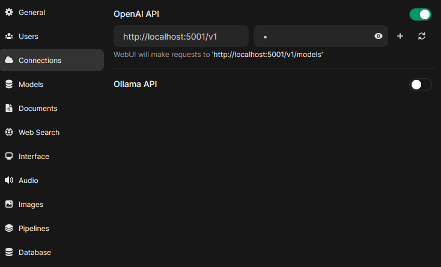
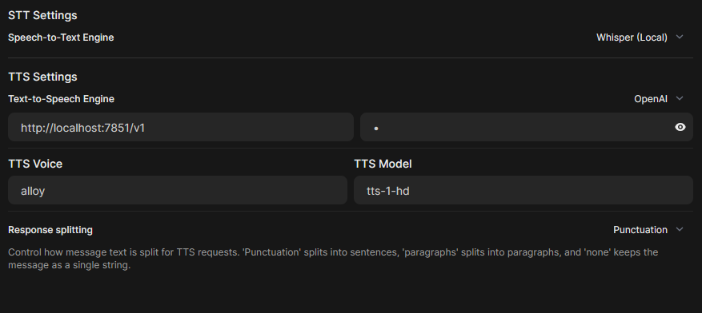
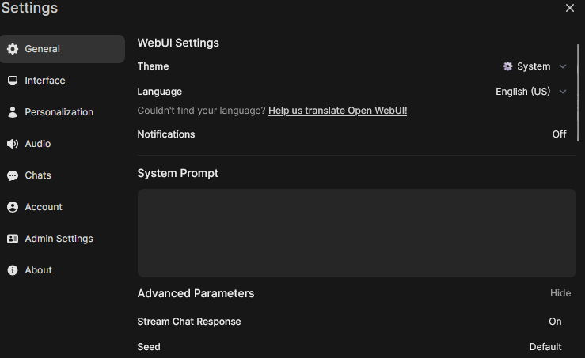
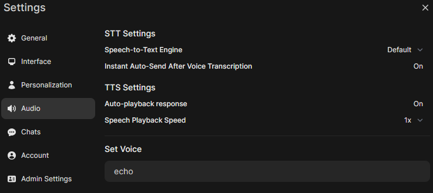
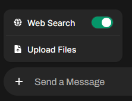

# Speech-to-speech realtime conversation setup

## Software used

-open-webui (+ faster-whisper local backend)

-alltalk (beta version with OpenAI REST API)

-searxng (optional web search functionality)

## Prerequisites

-NVIDIA GPU + latest drivers

-Python 3.11 [[https://www.python.org/downloads/release/python-3119/](https://www.python.org/downloads/release/python-3119/)]

[[https://www.python.org/ftp/python/3.11.9/python-3.11.9-amd64.exe](https://www.python.org/ftp/python/3.11.9/python-3.11.9-amd64.exe)]

-Cuda 12.x [[https://developer.nvidia.com/cuda-downloads](https://developer.nvidia.com/cuda-downloads)]

[[https://developer.download.nvidia.com/compute/cuda/12.6.2/local_installers/cuda_12.6.2_560.94_windows.exe](https://developer.download.nvidia.com/compute/cuda/12.6.2/local_installers/cuda_12.6.2_560.94_windows.exe)]

-cuDNN 8.9.6 or 8.9.7 [[https://developer.nvidia.com/rdp/cudnn-archive](https://developer.nvidia.com/rdp/cudnn-archive)]

[[https://developer.nvidia.com/downloads/compute/cudnn/secure/8.9.7/local_installers/12.x/cudnn-windows-x86_64-8.9.7.29_cuda12-archive.zip/](https://developer.nvidia.com/downloads/compute/cudnn/secure/8.9.7/local_installers/12.x/cudnn-windows-x86_64-8.9.7.29_cuda12-archive.zip/)]

Newer version is not compatible (missing cudnn_ops_infer64_8.dll).

-Docker desktop (only if you plan to use Searxng) [[https://docs.docker.com/desktop/install/windows-install/](https://docs.docker.com/desktop/install/windows-install/)]

## Windows Installation

### alltalk_tts (beta)

-Install it as standalone [[https://github.com/erew123/alltalk_tts/wiki/Install-‐-Standalone-Installation](https://github.com/erew123/alltalk_tts/wiki/Install-%E2%80%90-Standalone-Installation)]

-**If there are any dependency conflicts, choose transformers 4.40 for the streaming capability with CoquiTTS.**

-You can enable DeepSpeed in the UI settings if you have an NVIDIA GPU.

### open-webui

-Install it directly on a new python virtual environment [[https://github.com/open-webui/open-webui?tab=readme-ov-file#how-to-install-](https://github.com/open-webui/open-webui?tab=readme-ov-file#how-to-install-)]

Because we’re gonna use whisper on GPU to minimize latency, we need to also install torch, which isn't installed by default.

```bash
@echo off

set VENV_FOLDER=.venv
set PYTHON_VERSION=3.11

if not exist %VENV_FOLDER% (
    py -%PYTHON_VERSION% -m venv %VENV_FOLDER%
)

call %VENV_FOLDER%\Scripts\activate

pip install open-webui

pip install torch torchvision torchaudio --index-url https://download.pytorch.org/whl/cu121 --no-cache-dir 

:: Keep terminal open
cmd /k
```

Now in order to use faster-whisper on GPU, we need to start it with the environment variable ‘USE_CUDA_DOCKER=True’.

I recommend the model ‘large-v2’, but you can use any of the following:

tiny.en, tiny, base.en, base, small.en, small, medium.en, medium, large-v1, large-v2, large-v3, large, distil-large-v2, distil-medium.en, distil-small.en, distil-large-v3

```bash
@echo off

call .\venv\Scripts\activate.bat

set WHISPER_MODEL=large-v2
set USE_CUDA_DOCKER=True

open-webui serve
```

In order to further reduce hallucinations while transcribing with whisper, I recommend editing the code from the ‘.venv\Lib\site-packages\open_webui\apps\audio\main.py’ file.

At line 408, you should see something like this:

```bash
segments, info = model.transcribe(file_path, beam_size=5)
```

You should change it, adding the voice activation detection filter to it, and also, the language you’re planning to use, if it’s just one language:

```bash
segments, info = model.transcribe(file_path, language="en", beam_size=5, vad_filter=True)
```

This will ensure minimum hallucinations, specially cross-language hallucinations.

Now configure open-webui from the **admin panel**, with the Inference endpoint of your choice. We will be using OpenAI’s REST API, but if it’s a local solution (like koboldcpp), the API key is just a placeholder, you can use any string:



And configure the audio section, with both the local faster-whisper backend integrated in the webui, and the alltalk_tts backend for TTS:



Finally, enable streaming for the model in the **user settings**:



And enable auto send & playback:



## Web Search

To add web search functionality, follow the steps to install Searxng on docker: 

[[https://docs.openwebui.com/tutorials/features/web_search](https://docs.openwebui.com/tutorials/features/web_search)]

Additionally, you must edit the settings.yaml, adding the JSON format:

```yaml
search:
  safe_search: 0
  autocomplete: ""
  default_lang: ""
  formats:
    - html
    - json
```

Then enable it in the **admin panel**, and in each chat:

